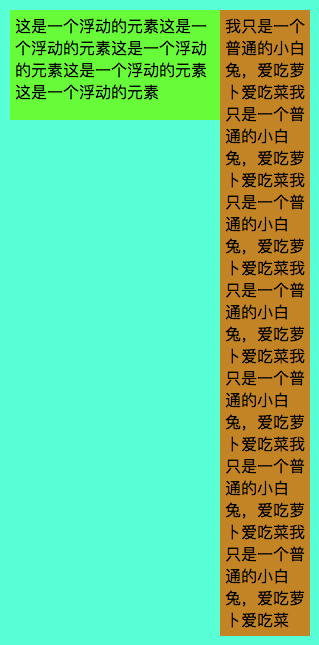

# 清楚浮动及BFC

在我门布局的是是有经常会出现有个元素会脱离文档流。例如float、定位。float 是前端布局中经常用到的布局模式，当一个元素具有浮动的属性之后，后面的兄弟元素将会无视浮动的元素进行布局。脱离文档流，浮动起来。浮动的框可以左右移动，直到遇到另一个浮动框或者遇到外边缘的包含框（BCF）。

例如：

``` css
.container {
    width: 300px;
    background-color: aquamarine;
    margin: 100px auto;
    padding: 10px;
}
.float {
    width: 200px;
    height: 100px;
    padding: 5px;
    background-color: chartreuse;
    float: left;
}
.content {
    padding: 5px;
    background-color: darkgoldenrod;
}
```

```html
<div class="container">
    <div  class="float">这是一个浮动的元素这是一个浮动的元素这是一个浮动的元素这是一个浮动的元素这是一个浮动的元素</div>
    <div class="content">我只是一个普通的小白兔，爱吃萝卜爱吃菜我只是一个普通的小白兔，爱吃萝卜爱吃菜我只是一个普通的小白兔，爱吃萝卜爱吃菜我只是一个普通的小白兔，爱吃萝卜爱吃菜我只是一个普通的小白兔，爱吃萝卜爱吃菜我只是一个普通的小白兔，爱吃萝卜爱吃菜我只是一个普通的小白兔，爱吃萝卜爱吃菜</div>
</div>
```
+ 需要注意的是文字的排版会避开浮动元素所占的区域，保证文字的全部展示，注意该规则会实现word中文字包围图片的排版样式。


### 如果当content的内容较少时会出现


``` css
.container {
    width: 300px;
    background-color: aquamarine;
    margin: 100px auto;
    padding: 10px;
}
.float {
    width: 200px;
    height: 100px;
    padding: 5px;
    background-color: chartreuse;
    float: left;
}
.content {
    padding: 5px;
    background-color: darkgoldenrod;
}
```

```html
<div class="container">
    <div  class="float">这是一个浮动的元素这是一个浮动的元素这是一个浮动的元素这是一个浮动的元素这是一个浮动的元素</div>
    <div class="content">我只是一个普通的小白兔。</div>
</div>
```


父元素的高度无法包含浮动元素的内容。

## BFC

(Block Formatting Context)块级格式化上下文，是用于布局块级盒子的一块渲染区域。具有 BFC 特性的元素可以看作是隔离了的独立容器，容器里面的元素不会在布局上影响到外面的元素，并且 BFC 具有普通容器所没有的一些特性。通俗的讲法，是BFC内部的元素无论怎样都不会影响外面的元素，为了不影响外面的元素所以BFC的元素将会完全包住子元素。

### 什么时候会触发BFC呢

+ float的值不为none。
+ overflow的值不为visible。
+ display的值为table-cell, table-caption, inline-block中的任何一个。
+ position的值不为relative和static。

上面的例子当设置了该条件中的任何一个container的高度都会被撑起来。

例：
``` css
.container {
    width: 300px;
    background-color: aquamarine;
    margin: 100px auto;
    padding: 10px;
    overflow: auto;
}
.float {
    width: 200px;
    height: 100px;
    padding: 5px;
    background-color: chartreuse;
    float: left;
}
.content {
    padding: 5px;
    background-color: darkgoldenrod;
}
```

```html
<div class="container">
    <div  class="float">这是一个浮动的元素这是一个浮动的元素这是一个浮动的元素这是一个浮动的元素这是一个浮动的元素</div>
    <div class="content">我只是一个普通的小白兔。</div>
</div>
```


该方法经常会被用到解决父容器高度塌陷

### 自适应布局

我们可以利用  <b>浮动的框可以左右移动，直到遇到另一个浮动框或者遇到外边缘的包含框（BCF） </b>  该特性进行自适应布局。

例子：

```css
.container {
    width: 300px;
    background-color: aquamarine;
    margin: 100px auto;
    padding: 10px;
}
.float {
    width: 200px;
    height: 100px;
    padding: 5px;
    background-color: chartreuse;
    float: left;
}
.content {
    padding: 5px;
    background-color: darkgoldenrod;
    overflow: auto;
}
```

```html
<div class="container">
    <div  class="float">这是一个浮动的元素这是一个浮动的元素这是一个浮动的元素这是一个浮动的元素这是一个浮动的元素</div>
    <div class="content">我只是一个普通的小白兔，爱吃萝卜爱吃菜我只是一个普通的小白兔，爱吃萝卜爱吃菜我只是一个普通的小白兔，爱吃萝卜爱吃菜我只是一个普通的小白兔，爱吃萝卜爱吃菜我只是一个普通的小白兔，爱吃萝卜爱吃菜我只是一个普通的小白兔，爱吃萝卜爱吃菜我只是一个普通的小白兔，爱吃萝卜爱吃菜</div>
</div>
```

效果：



(偷笑，老子终于可以不用flex了)


## 清楚浮动

出了上面所说通过将元素变为BFC解决父容器高度塌陷，最长用的解决方法是清除浮动。

```css
.clearfloat:after{
    display:block;
    clear:both;
    content:"";
    visibility:hidden;
    height:0
}
/*
    zoom(IE转有属性)可解决ie6,ie7浮动问题， ie8 以上才有after属性
*/
.clearfloat{
    zoom:1
}
```
### 原理
clear 属性是指该元素的哪一侧没有浮动的元素。设置该属性后浏览器会在父元素的垂直方向上会清理一块区域用来存放after元素。
clear设置为both 说明两侧都没有浮动元素，用来房子两侧都没有浮动的元素，使用的场景更广。


