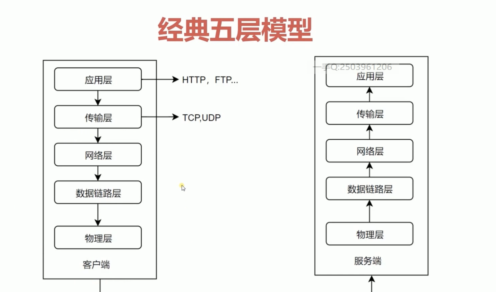

# http

## http 分为经典的五层模型

## http 发展协议历史

### http/0.9

+ 只有一个命令GET
+ 没有HEADER等描述信息
+ 服务器发送完毕，就关闭TCP链接。

### http/1.0

+ 增加了很多命令 post、put、delete
+ 增加了status code和header
+ 增加了多字符集的支持，多不分的发送，权限,缓存

### http/1.1

+ 持久链接
+ pipeline
+ 增加host和其他一些命令

### http2

+ 所有数据都是以二进制传输的。
+ 多路复用(但是如果传输的过程中出现丢包的情况，http2的反应性能还不如http1.1, )
+ 头信息压缩
+ server push

### http3

+ 搞了一个基于 UDP 协议的 QUIC 协议
+ 多路复用 同一条 QUIC连接上可以创建多个stream，来发送多个HTTP请求，但是，QUIC是基于UDP的，一个连接上的多个stream之间没有依赖。

### URI 
统一资源标识符

用来标识互联网上的信息资源

包含了URL和URN 

### URL

统一支援定位器

例如ftp

### RUN

永久统一资源定位符

## http报文

### 请求报文

+ 首行/起始行
    + method 方法,定义对资源的操作。
    + url 请求资源的地址
    + 协议的版本
    + 

+ 相应的首行
    + http协议
    + code 服务器对请求的结果。
        + 1 请求开始
        + 2 请求成功
        + 3 需要重定向
        + 4 客户端请求错误
        + 5 服务端错误
    + ok